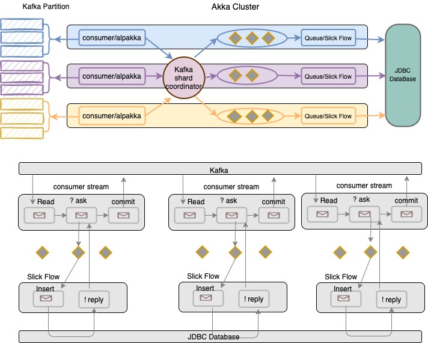

# Kafka to Akka cluster sharding


Read the following documentation to learn more about [Akka Cluster External Shard Allocation](https://doc.akka.io/docs/akka/current/typed/cluster-sharding.html#external-shard-allocation) 
and its support for Kafka in [Alpakka Kafka Cluster Sharding](https://doc.akka.io/docs/alpakka-kafka/current/cluster-sharding.html).





# Running the sample 

The sample is made up of three applications:
* `producer` A Kafka producer, that produces events about users 
* `processor` An Akka Cluster Sharding application that reads the Kafka topic and forwards the messages to a sharded
              entity that represents a user and a gRPC front end for accessing the sharded actors state
* `client` A gRPC client for interacting with the cluster
              
The sample demonstrates how the external shard allocation strategy can be used so messages are processed locally.

The sample depends on a Kafka broker running locally on port `9092` with a topic with 128 partitions called `user-events`. 
[Kafka can be run in Docker](https://github.com/wurstmeister/kafka-docker) .

### Set up - Akka Telemetry 
Project is configured to use Akka Cinnamon . We need to configure provide credential detail.
[Instruction](https://developer.lightbend.com/docs/telemetry/current/getting-started/start.html)

### Set up - Set up Kafka and Postgres Data base
```
  docker compose up -d 
```
Once the postgres database is running , we need to execute following command to create table for kafk consumer to store record.

```
docker exec -i trs-task-consumer_mysql-db_1 mysql --database=trs-task-db -uroot -p"admin" -t < ddl-scripts/create_wallet_tables.sql

```


Once the Kafka  and database is started we can start the processor
 
```
sbt "processor / run 2551 8551 8081"
```

The processor starts a KafkaConsumer, as it is the only consumer in the group it will be assigned every single Kafka partition
and shards for each partition will be assigned to the current node. You will see logs like:


Next we start the Kafka producer to see some messages flowing from Kafka to sharding.

```
sbt "producer / run"
```

In the producer window you'll see:

```
[INFO] [01/16/2020 09:51:38.639] [UserEventProducer(akka://UserEventProducer)] Sending message to user 29
[INFO] [01/16/2020 09:51:39.660] [UserEventProducer(akka://UserEventProducer)] Sending message to user 60
[INFO] [01/16/2020 09:51:40.680] [UserEventProducer(akka://UserEventProducer)] Sending message to user 75

```

In the single processor node the messages will start flowing:

```
[info] [2020-01-16 09:51:38,672] [INFO] [sample.sharding.kafka.UserEventsKafkaProcessor$] [KafkaToSharding-akka.actor.default-dispatcher-26] [akka://KafkaToSharding/user/kafka-event-processor] - entityId->partition 29->45
[info] [2020-01-16 09:51:38,672] [INFO] [sample.sharding.kafka.UserEventsKafkaProcessor$] [KafkaToSharding-akka.actor.default-dispatcher-26] [akka://KafkaToSharding/user/kafka-event-processor] - Forwarding message for entity 29 to cluster sharding
[info] [2020-01-16 09:51:38,673] [INFO] [sample.sharding.kafka.UserEvents$] [KafkaToSharding-akka.actor.default-dispatcher-26] [akka://KafkaToSharding/system/sharding/user-processing/75/29] - user 29 purchase cat t-shirt, quantity 0, price 8874
[info] [2020-01-16 09:51:39,702] [INFO] [sample.sharding.kafka.UserEventsKafkaProcessor$] [KafkaToSharding-akka.actor.default-dispatcher-17] [akka://KafkaToSharding/user/kafka-event-processor] - entityId->partition 60->111
[info] [2020-01-16 09:51:39,703] [INFO] [sample.sharding.kafka.UserEventsKafkaProcessor$] [KafkaToSharding-akka.actor.default-dispatcher-17] [akka://KafkaToSharding/user/kafka-event-processor] - Forwarding message for entity 60 to cluster sharding
[info] [2020-01-16 09:51:39,706] [INFO] [sample.sharding.kafka.UserEvents$] [KafkaToSharding-akka.actor.default-dispatcher-17] [akka://KafkaToSharding/system/sharding/user-processing/2/60] - user 60 purchase cat t-shirt, quantity 2, price 9375
[info] [2020-01-16 09:51:40,732] [INFO] [sample.sharding.kafka.UserEventsKafkaProcessor$] [KafkaToSharding-akka.actor.default-dispatcher-17] [akka://KafkaToSharding/user/kafka-event-processor] - entityId->partition 75->1
[info] [2020-01-16 09:51:40,732] [INFO] [sample.sharding.kafka.UserEventsKafkaProcessor$] [KafkaToSharding-akka.actor.default-dispatcher-17] [akka://KafkaToSharding/user/kafka-event-processor] - Forwarding message for entity 75 to cluster sharding
```

The first log line is just after the message has been taken from Kafka.
The second log is from the sharded entity. The goal is to have these
always on the same node as the external shard allocation strategy will move the shard to where ever the
Kafka partition is being consumed.

As there is only one node we get 100% locality, each forwarded message is processed on the same node

Now let's see that remain true once we add more nodes to the Akka Cluster, add another with different ports:

```
sbt "processor / run 2552 8552 8082"
```

When this starts up we'll see Kafka assign partitions to the new node (it is in the same consumer group):

```
Partition [29] assigned to current node. Updating shard allocation
```

On one of the nodes, where the ShardCoordinator runs, we'll see the rebalance happening:

```
[info] [2020-01-16 09:59:39,923] [INFO] [akka://KafkaToSharding@127.0.0.1:2551/system/sharding/user-processingCoordinator/singleton/coordinator] - Starting rebalance for shards [45,33,16,2,3,15,11,6,36]. Current shards rebalancing: []
```

Both nodes now have roughly 64 shards / partitions, all co-located with the Kafka Consuemer.
You can verify this by the logs showing that when a message is received by the Kafka Consumer when it is forwarded to 
cluster sharding the entity logs receiving the event on the same node. 

```
[info] [2020-01-17 08:27:58,199] [INFO] [akka://KafkaToSharding/user/kafka-event-processor] - Forwarding message for entity 29 to cluster sharding
[info] [2020-01-17 08:27:58,204] [INFO] [akka://KafkaToSharding/system/sharding/user-processing/45/29] - user 29 purchase cat t-shirt, quantity 1, price 2093
[info] [2020-01-17 08:28:08,218] [INFO] [akka://KafkaToSharding/user/kafka-event-processor] - Forwarding message for entity 56 to cluster sharding
[info] [2020-01-17 08:28:08,218] [INFO] [akka://KafkaToSharding/system/sharding/user-processing/6/56] - user 56 purchase akka t-shirt, quantity 3, price 8576
[info] [2020-01-17 08:28:28,288] [INFO] [akka://KafkaToSharding/user/kafka-event-processor] - Forwarding message for entity 44 to cluster sharding
[info] [2020-01-17 08:28:28,296] [INFO] [akka://KafkaToSharding/system/sharding/user-processing/59/44] - user 44 purchase cat t-shirt, quantity 3, price 9716
```


